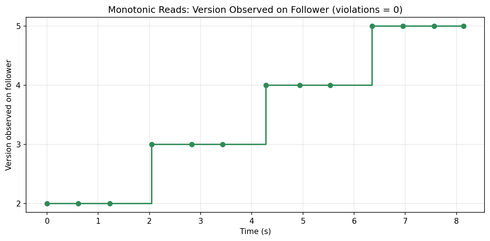
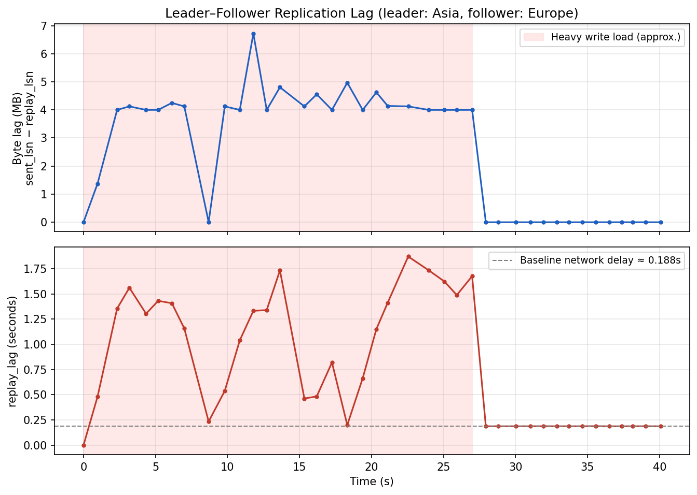
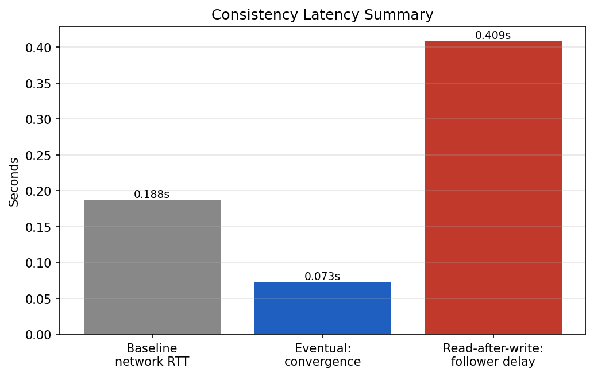

# 🌍 Single-Leader Replication Across Two Continents

A PostgreSQL 18 primary–replica setup deployed **on purpose** across Singapore and Stockholm, built to make replication lag and consistency violations something you can actually measure instead of something you read about.

> In short: two AWS instances 9,000 km apart, streaming WAL between them, with every write, every read, and every lag sample logged to the database — so eventual consistency stops being a definition and becomes a graph.

---

## 🎯 Why Two Continents?

Replication behaviour is easy to describe and hard to observe. On a single machine — or two nodes in the same availability zone — the follower is caught up in well under a millisecond. Eventual consistency looks instantaneous, monotonic reads look trivially satisfied, and the failure modes you actually want to study never appear.

So the geography here is the experiment design, not a deployment detail:

- **Leader** — AWS `ap-southeast-1` (Singapore, Asia), Ubuntu, `t3.micro`, PostgreSQL 18. Accepts all writes.
- **Follower** — AWS `eu-north-1` (Stockholm, Europe), Ubuntu, `t3.micro`, PostgreSQL 18. Read-only standby.

The distance buys a **~0.188 s network floor** that never goes away. Every measurement below sits on top of it, which is exactly what makes the numbers interpretable.

```
Client ──writes──▶  LEADER (Singapore)
                        │
                        │  WAL streaming over TCP 5432
                        │  physical replication slot: follower_slot
                        ▼
                    FOLLOWER (Stockholm)  ──reads──▶ Client
                        (read-only standby)
```

Both nodes hold static Elastic IPs. The follower authenticates with a dedicated `replicator` role and continuously replays the leader's Write-Ahead Log.

---

## 🧠 Quick Explanation (Non-Technical)

Every change on the leader is written to a log. The follower reads that log over the internet and applies the same changes to its own copy, in the same order.

Because the two machines are on opposite sides of the world, the follower is always slightly behind. This project measures *how far* behind — under no load, under heavy load, and in the seconds after the load stops — and checks whether that delay can ever make a reader see something impossible, like a value moving backwards.

Short answer: the delay is real and grows under load, but the follower never lies about order.

---

## 🗄️ Schema Design

The domain is a deliberately boring product/stock catalogue. The interesting part is the instrumentation around it — six tables, split between the thing being changed and the record of what happened.

| Table | Purpose |
| --- | --- |
| `products` | The entity the experiments operate on. Carries `version`, `operation_id` and `last_updated` so update order and visibility can be tracked across nodes. |
| `write_log` | Every INSERT/UPDATE/DELETE on `products`, captured automatically by trigger, with a timestamp **and the WAL LSN at write time**. |
| `read_log` | Every read performed during an experiment, tagged with source node (`leader`/`follower`) and the version observed. Used to detect monotonic-reads violations. |
| `replication_lag_samples` | Periodic snapshots of lag in bytes (LSN difference) and in time (`replay_lag`). |
| `experiment_runs` | Metadata per execution — name, parameters, start/end — so every log row ties back to a run. |
| `consistency_observations` | Computed metrics per run: convergence time, violation count, RAW success, order preserved. |

```sql
CREATE TABLE products (
    product_id   BIGINT GENERATED ALWAYS AS IDENTITY PRIMARY KEY,
    sku          TEXT NOT NULL UNIQUE,
    name         TEXT NOT NULL,
    stock_qty    INTEGER NOT NULL DEFAULT 0,
    price        NUMERIC(10,2) NOT NULL DEFAULT 0,
    version      INTEGER NOT NULL DEFAULT 1,        -- monotonic reads
    operation_id UUID NOT NULL DEFAULT gen_random_uuid(),
    last_updated TIMESTAMPTZ NOT NULL DEFAULT clock_timestamp(),
    is_deleted   BOOLEAN NOT NULL DEFAULT FALSE
);
```

Because this is **physical** streaming replication, the entire cluster is copied — schema, data and the logging tables themselves. That has one consequence worth stating explicitly: the follower is strictly read-only, so *every* log row, including logs about reads performed on the follower, is written on the leader.

---

## 🔬 Logging Mechanism

Write logging is not something the client can forget to do. A row-level trigger handles it, and — the part that makes the ordering analysis possible — it captures the current WAL position at write time:

```sql
CREATE TRIGGER trg_log_write
AFTER INSERT OR UPDATE OR DELETE ON products
FOR EACH ROW EXECUTE FUNCTION log_write();
```

`log_write()` inserts into `write_log` with the operation type, resulting version, `operation_id`, the client tag from `current_setting('app.client_id', true)`, and `pg_current_wal_lsn()`. Once the LSN is recorded per write, "which write happened first" is no longer a question about wall clocks on two machines in two regions.

Lag logging samples `pg_stat_replication` on the leader, which reports both the byte distance between `sent_lsn` and `replay_lsn` and the time-based write/flush/replay lag.

---

## ⚙️ Replication Setup

On the leader:

```conf
# postgresql.conf
listen_addresses     = '*'
wal_level            = replica
max_wal_senders      = 10
max_replication_slots = 10
wal_keep_size        = 512MB
hot_standby          = on
```

```sql
CREATE ROLE replicator WITH REPLICATION LOGIN PASSWORD '***';
SELECT pg_create_physical_replication_slot('follower_slot');
```

```conf
# pg_hba.conf
host replication replicator <follower_net> scram-sha-256
```

The follower is initialised as an exact copy with `pg_basebackup`. The `-R` flag writes the standby signal and primary connection string, so the node comes up already streaming:

```bash
pg_basebackup -h <LEADER_IP> -U replicator \
  -D /var/lib/postgresql/18/main \
  -P -R -X stream -S follower_slot -W
```

Verified from both sides: on the leader `pg_is_in_recovery()` returns `f` and `pg_stat_replication` shows the follower in `state = streaming`; on the follower `pg_is_in_recovery()` returns `t`.

---

## 🧪 The Experiments

All four are driven by one Python client that writes to the leader, reads from the follower, and records everything into the logging tables.

### 1) Eventual Consistency — *how long until the follower catches up?*

Insert a row on the leader, then poll the follower until it appears.

**Result: 0.073 s** under light load. The follower does lag, but converges — and converges fast enough that you would miss it entirely without instrumentation.

### 2) Monotonic Reads — *can a value move backwards?*

Increment `version` from 1 → 5 on the leader while reading the follower repeatedly. Any read returning a lower version than an earlier one counts as a violation.

**Result: 0 violations**, observed sequence `[2,2,2,3,3,3,4,4,4,5,5,5,5]`.



A single follower replays the WAL strictly in order, so a client reading it never sees time run backwards. Worth noting *why* this holds: it's a property of there being **one** follower applying **one** ordered log. Add a second replica and route reads across both, and this guarantee disappears.

### 3) Read-After-Write — *do I see my own write?*

Write on the leader, immediately read back from the leader, then time how long the follower takes to reflect it.

**Result: immediate on the leader, 0.409 s on the follower.** This is the central trade-off of single-leader replication in one line — the writing client gets read-after-write consistency for free, while everyone reading the replica gets a stale window.

### 4) Concurrent / Rapid Writes — *does order survive the trip?*

Ten inserts in quick succession; the order in `write_log` on the leader compared against the order on the follower.

**Result: identical sequences** (`product_id` 5–14), `order_preserved = true`. WAL ships and replays in commit order, so the follower is late but never out of order.

---

## 📈 Replication Lag Under Load

A dedicated script drives a heavy write load on the leader while a background thread samples `pg_stat_replication` every 0.3 s. Sampling continues **after** the load stops, so the curve captures both the climb and the drain.

Two measures:

- **Byte lag** — `pg_wal_lsn_diff(sent_lsn, replay_lsn)`
- **Time lag** — `replay_lag`



**Findings:**

- **At rest:** 0 MB byte lag — the follower is caught up. But a **~0.188 s replay delay remains**. That floor is the Asia–Europe round trip, and no amount of tuning removes it.
- **Under load:** byte lag climbed to **4–6.7 MB**, `replay_lag` peaked at **~1.87 s**.
- **After load:** both measures dropped back to baseline **within a second**.

That last point is the whole thesis of eventual consistency, observed at the WAL level rather than asserted: the replica falls behind when pushed, and closes the gap on its own when the pressure ends.

---

## 📊 Results Summary

| Experiment / Metric | Result |
| --- | --- |
| Eventual consistency — convergence time | **0.073 s** |
| Monotonic reads — violations | **0** (sequence 2→3→4→5) |
| Read-after-write — on leader | **Success (immediate)** |
| Read-after-write — follower visibility delay | **0.409 s** |
| Concurrent writes — order preserved | **Yes** (ids 5–14 identical) |
| Replication lag — baseline network delay | **~0.188 s** |
| Replication lag — peak under load | **~6.7 MB / ~1.87 s** |



---

## 🧩 Repository Structure

```
schema.sql        – six tables, logging trigger, seed data (run on the LEADER only)
config.py         – connection settings, read from environment / .env
experiments.py    – the four consistency experiments; writes to leader, reads from follower
lag_demo.py       – heavy write load + continuous lag sampling (rise and drain)
make_charts.py    – reads the logged data back out and regenerates the figures
.env.example      – template for local credentials (.env itself is git-ignored)
docs/             – generated figures
```

Every figure in this README is generated from data actually recorded in the database during a run — nothing is drawn by hand.

---

## 🛠️ Reproducing It

```bash
# 1. Provision two PostgreSQL 18 instances in different regions.
#    Open TCP 5432 from the follower to the leader.

# 2. On the LEADER: apply config above, create the replication role and slot, then:
psql -f schema.sql

# 3. On the FOLLOWER: initialise from the leader.
pg_basebackup -h <LEADER_IP> -U replicator -D /var/lib/postgresql/18/main \
  -P -R -X stream -S follower_slot -W

# 4. Configure connection settings.
cp .env.example .env      # then fill in hosts, user and password

# 5. Run the experiments (from the leader), then the lag demo (from any host).
pip install psycopg2-binary matplotlib
python3 experiments.py
python3 lag_demo.py
python3 make_charts.py    # regenerates the figures in docs/
```

All three scripts read their connection settings from `config.py`, which pulls from the environment or a local `.env`. Nothing is hardcoded, and `.env` is git-ignored.

> **Note on `lag_demo.py`:** it generates several MB of WAL per batch by design. On an 8 GB `t3.micro` volume that adds up quickly, so the script drops its load table when it finishes.

---

## 🔍 What I'd Do Next

- **Add a second follower** and route reads across both — the monotonic-reads guarantee should break, and it would be satisfying to catch it breaking.
- **Compare synchronous commit modes.** Everything here runs asynchronously; `synchronous_standby_names` would trade that 0.409 s stale window for write latency, and across this distance the cost would be visible.
- **Simulate failover.** Promote the follower mid-load and measure what's lost between the last replayed LSN and the last committed one.

---

## 📚 Context

Built for **CENG 465 — Principles of Data-Intensive Systems**, İzmir Institute of Technology.

Every figure here was generated by `make_charts.py` from data recorded during an actual run against the two-region deployment described above.
